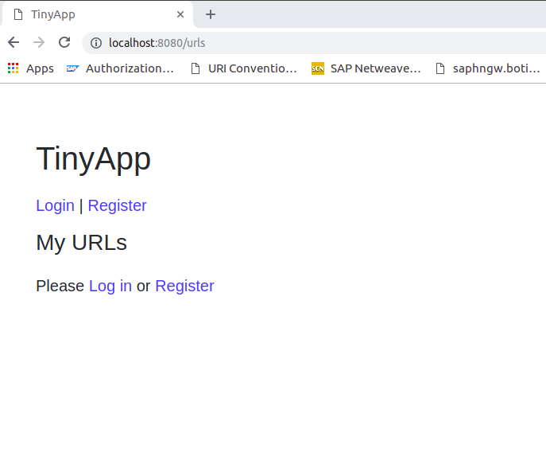
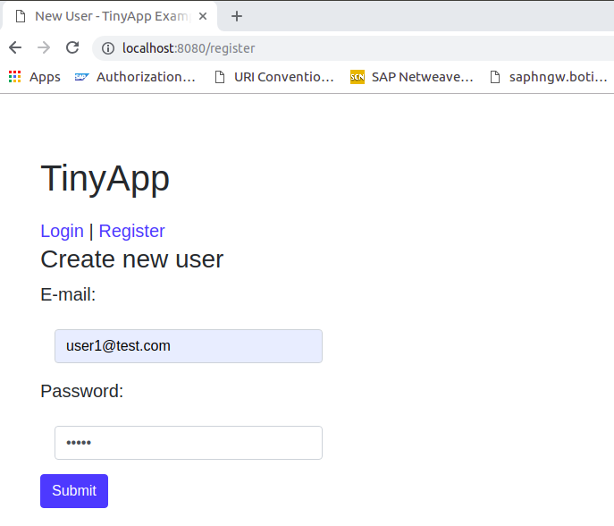
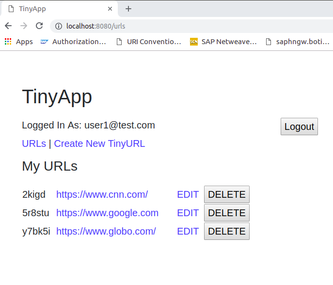
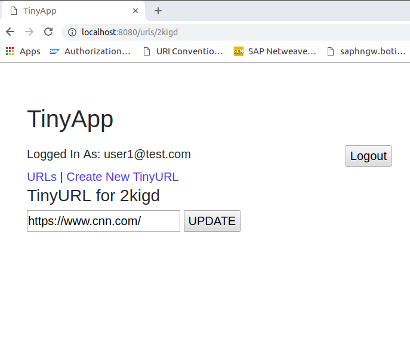

# About the App

The app is a full stack web application built with Node and Express that allows users to shorten long URLs.

## Final Product

#### Main Page

#### Register Page

#### URLs Page

#### Edit URLs Page

## Dependencies
* bcrypt
* body-parser
* cookie-session
* ejs
* express
* Node.js
* method-override

## Getting Started

* Install all dependencies using the `npm install` command.
* Run the development web server using the `node express_server.js` command.

## Stretch

* Method-override
* Created date